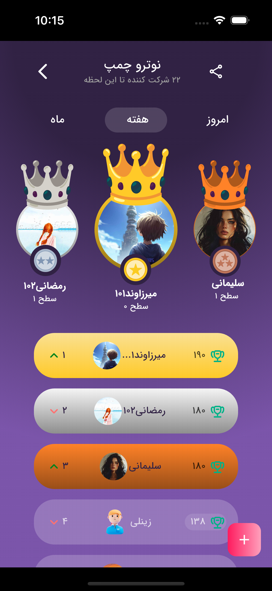
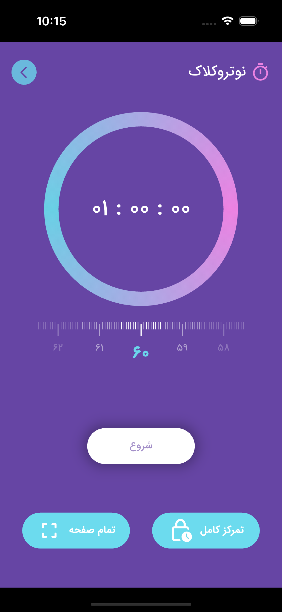

# 🚀 Notruphil-app
The project focuses on helping students study more effectively and facilitating seamless communication between students and their academic advisors. Advisors can create personalized study plans for their students and track their progress over time.(source code private for privacy reasons)

## 🛠 Features

- Distraction-free study sessions using a focus timer lock:
Helps students maintain complete concentration by locking the device during study periods, minimizing distractions and promoting deep focus.

- Daily and hourly study planning by both students and advisors:
Allows students and their academic advisors to collaboratively design personalized study schedules for each day and hour. Both parties can track the student’s progress in real time.

- Custom quiz creation for student assessment:
Enables advisors to design quizzes tailored to each student’s learning path, helping evaluate their understanding and track improvemen
- Competitive panel:
Encourages students to stay motivated by allowing them to compete with peers in a friendly environment.
- Customizable calendar:
Offers a fully customizable calendar.

## 📸 Screenshots

### Login Screen
> Login page that allows users to log in either by receiving a code sent to their phone number or by using their username and password.

  

    
    
  

### Home Screen
> On the main page, you can view personalized schedules provided by both the student and the advisor. The orange schedule is set by the student, while the red schedule is assigned by the advisor. The "وضعیت من" section, designed like a car's speedometer, displays the student's overall study progress, including the number of quizzes taken, study hours, completed and pending tasks, and more.

  

    
    
  

> In the calendar section, the green color indicates that over 70% of the day's tasks have been completed. The orange color represents completion below 70%, while the red color means less than 20% of the tasks have been completed.

  

    
    
  

### Notru-Plus Screen (Tools page)
> On this page, from top to bottom, you can see the user's profile picture and the notifications section. Below that, the countdown to the next exam is displayed. The competitive panel shows the top 3 students of the day in terms of study progress. The green section provides access to the timer, and further down, the app's tools are listed, each of which will be detailed separately in the following sections.

  

    
    
  

### Profile Screen and edit Profile Screen
> In this section, the user's information, including their education level, biography, and notifications, is displayed. You can edit your personal details in the account settings section. Information related to your field of study and education level provides you with access to the relevant courses for that level.

  

    
    
    
  

### Competitive Panel
> In this section, you can view your rank among all students as well as see the top-performing students. Detailed statistics show your progress compared to others, including study hours, number of quizzes completed, and tasks achieved. The panel provides a clear view of how you measure up against your peers, motivating you to keep improving and stay engaged.Additionally, the Manual Entry section allows you to input data such as the number of quizzes taken and study hours manually. Based on this information, your rank will be updated accordingly.

  

    
    
    
     
  

### Quiz Screen
>In the quiz section, you can view your available quizzes, participate in them, and check your results. After completing a quiz, you can access your report card, including the answer key and detailed analysis of each question.

  
   
   

### 🕒 Notro-Clock (Timer)
>This customized timer allows you to study and record your study hours. You can also activate the Focus Lock mode, which locks your phone and helps you avoid distractions for a more effective study session.

  
   
   

#### ✅ Step 1: Battery Access
>To ensure the timer and focus mode work properly in the background, battery optimization access is required.

  

---

#### ✅ Step 2: Start Timer

  

---
#### ✅ Step 3: Exit Timer

  

---

#### ✅ Step 4: Save Study

  
   
   
   
    

---

#### ✅ Step 4: Enter Tests
>Enter the number of tests you studied, along with the number of correct, incorrect, and unanswered questions.

  

---

### 📚 Detail of your Study
>On this page, you can view detailed records of your study sessions, including total study hours, subject descriptions, and study types such as watching educational videos, reviewing, learning new material, and taking practice tests. The covered topics are also clearly displayed.

  

    
    
     
    
  

---

### 📝➕ Add Study
>To add a new study plan, you first select the type of session (e.g., review, new study, practice test), then choose the subject and specific topic to be studied. After that, you set the duration and optionally add a description or notes.

  
   
   

